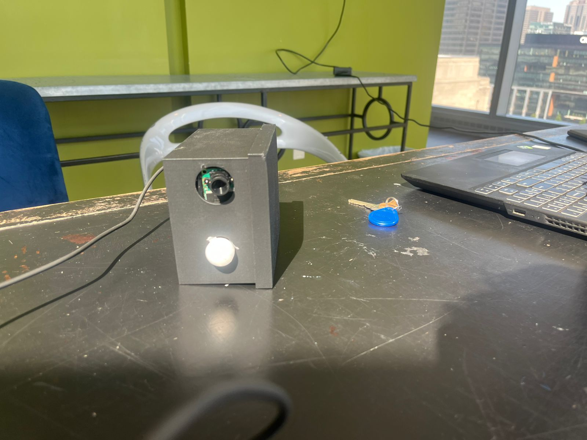
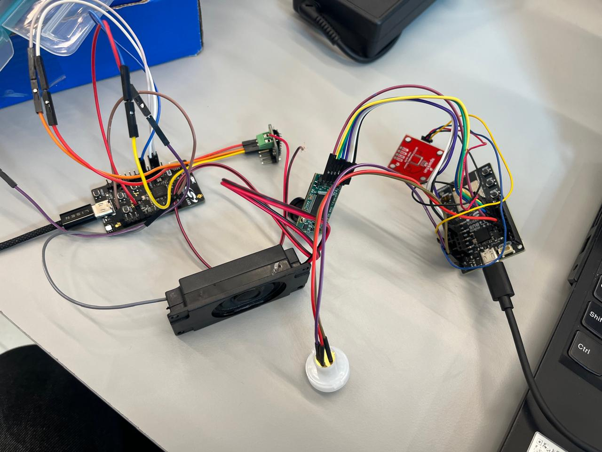
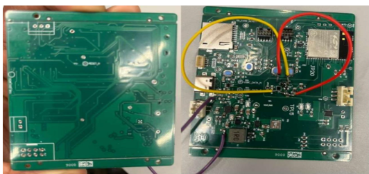
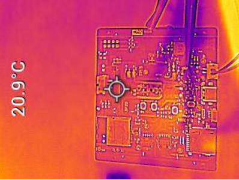
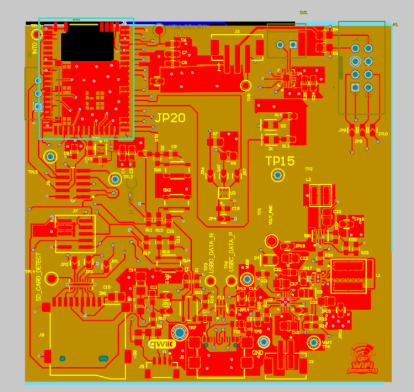
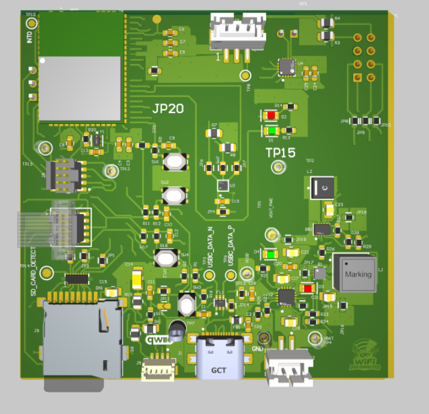
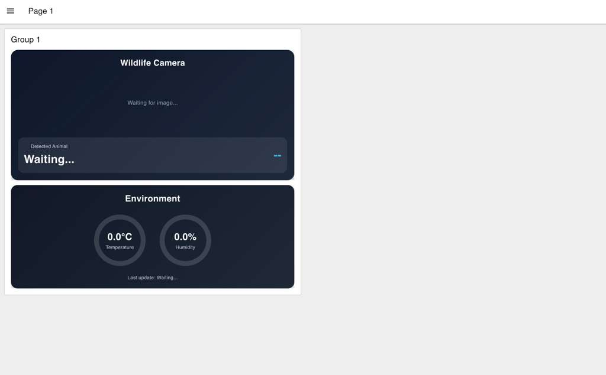
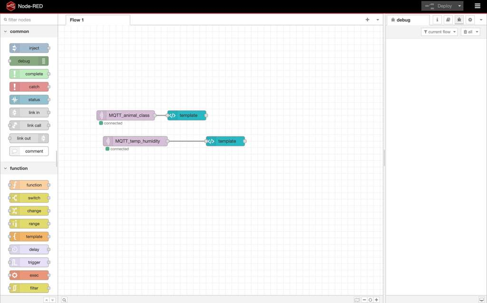
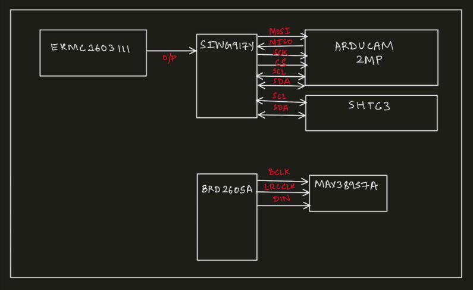
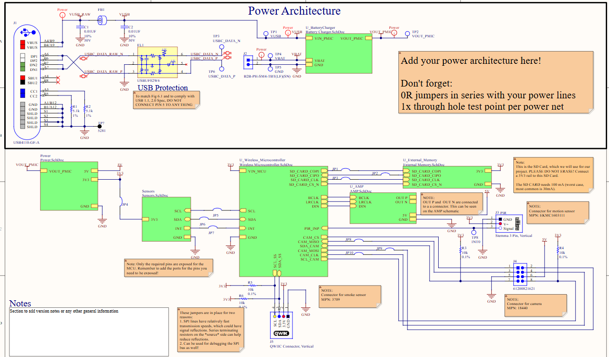

# a11g-final-submission

**Team Number:** 26

**Team Name:** Wifi Disconnected

| Team Member Name | Email Address           | GitHub Username |
| ---------------- | ----------------------- | --------------- |
| Rajath Ramana    | rajath@seas.upenn.edu   | rajathramana    |
| Pranay Choudhuri | pranay24@seas.upenn.edu | Pranay24704     |

**GitHub Repository URL:** https://github.com/ese5160/a11g-final-submission-s26-s26-t26-wifi-disconnected.git

## 1. Video Presentation

[Link to Video Presentation](https://drive.google.com/file/d/1pQ1dyIpgDubslwa4XStoypSGHShU1O4s/view?usp=sharing)

## 2. Project Summary

### Device Description

The Smart Wildlife Trap Camera is an IoT system that detects animal presence in forest zones using a PIR motion sensor and camera, automatically capturing and classifying wildlife through cloud-based computer vision. It solves the problem of requiring human presence in remote forest areas for wildlife monitoring and fire hazard detection, enabling rangers to be alerted in real time from a central office.

We were inspired by the need for scalable, low-cost wildlife monitoring systems that can operate autonomously in areas where human patrol is dangerous or impractical. The device also simultaneously monitors temperature and humidity to flag potential forest fire conditions.

The internet connects the field device to a cloud CV model that classifies the captured animal species, streams data to a live Node-RED dashboard, and triggers an audio alert on a second IoT device at the ranger station — all without any human in the field.

---

### Device Functionality

The system consists of two boards:

**Board 1 (Field Unit):**

* PIR sensor detects motion → triggers camera capture
* DHT sensor reads temperature and humidity
* Image + environmental data uploaded to cloud via WiFi
* OpenCV model classifies animal species

**Board 2 (Ranger Station):**

* Receives classification result from cloud via MQTT
* Amplifier + speaker plays "Animal detected" audio alert

**Key components:** PIR sensor, camera module, DHT22 temp/humidity sensor, Silicon Labs wireless SoC, TPS62082 3.3V buck regulator, amplifier speaker module.

---

### Challenges

**Firmware:** I2C bus was locking up due to the peripheral clock being enabled after I2C registers were written. Fixed by correcting initialization order and updating the device address to match hardware pin logic levels.

**Hardware:** A few components were missing from the PCBA and the USB slot was not properly soldered on one board, requiring rework before testing could proceed.

**Integration:** Synchronizing the MQTT message flow between the cloud CV pipeline and Board 2's audio actuation required careful timing and topic management in Node-RED.

---

### Prototype Learnings

* Always verify I2C initialization order in firmware - clock must be enabled before register writes
* PCB optical inspection must be thorough before powering up; missing components cause hard-to-debug failures
* The 3.3V buck regulator (TPS62082) performed well with only 2.32% error and 4.54% ripple, within acceptable limits for this application
* If building again, we would add a dedicated SD card slot for local image storage as a backup when WiFi is unavailable, and use a wider enclosure box to better manage internal wiring

---

### Next Steps & Takeaways

**Next steps:**

* Weatherproof the enclosure for actual outdoor forest deployment
* Add solar charging for the LiPo battery for long-term autonomous operation
* Expand the CV model to classify more species and detect fire/smoke directly
* Add GPS tagging to each captured image for location tracking

**ESE5160 Takeaways:**

* End-to-end IoT system design from PCB bring-up to cloud integration
* Power regulation analysis, load testing, and oscilloscope measurement techniques
* PCBA design, soldering, and debugging real hardware failures
* Node-RED dashboard design for real-time IoT data visualization
* The importance of system-level thinking - every layer (hardware, firmware, cloud, actuation) must be designed together

---

### Project Links

* **Node-RED:** [http://135.232.181.147:1880](http://135.232.181.147:1880)
* **Dashboard:** [http://135.232.181.147:1880/dashboard/page1](http://135.232.181.147:1880/dashboard/page1)
* **PCB on Altium 365:** [Final PCB v1](https://upenn-eselabs.365.altium.com/designs/E1A18451-5D17-42C9-AB41-CDE8407332D5)

## 3. Hardware & Software Requirements

Hardware & Software Requirements Validation

HARDWARE REQUIREMENTS SPECIFICATION (HRS)

HRS 01 – MCU / Wi-Fi
The system shall use a 2.4 GHz Wi-Fi capable MCU with ≥512 KB SRAM, sufficient to run a TensorFlow Lite model locally at 3.3V.

Status: Met

The Silicon Labs EFR32 MCU was used, which supports 2.4 GHz Wi-Fi and has sufficient SRAM. Firmware was successfully flashed and verified via VS Code. The board operated at 3.3V regulated output confirmed by oscilloscope measurements.

---

HRS 02 – Environmental Sensing
The system shall include a TI HDC2010 (temperature ±0.2°C, humidity ±2% RH, I2C) and a smoke/VOC sensor (ENS160) via the QWIIC connector.

Status: Partially Met

The HDC2010 was integrated and I2C communication was verified after fixing a clock initialization bug in firmware. Temperature and humidity readings were successfully streamed to the Node-RED dashboard. The ENS160 smoke/VOC sensor was connected via QWIIC but full calibration validation against a reference sensor was not completed due to time constraints.

---

HRS 03 – Motion Detection
The system shall include a 3.3V-compatible PIR sensor on PIR_INP, capable of generating an edge interrupt to wake the MCU from deep sleep.

Status: Met

The PIR sensor was wired to PIR_INP and tested for edge interrupt generation. The MCU successfully woke from deep sleep on motion detection during integration testing. The sensor operates at 3.3V confirmed by the regulated supply.

---

HRS 04 – Camera
The system shall include a camera module on SPI (CAM_CLK/MOSI/MISO/CS) with I2C configuration, capturing ≥96×96 px images for TFLite inference input.

Status: Met

Camera was configured over SPI and I2C. Images were successfully captured and sent to the cloud for OpenCV-based animal classification. Image resolution met the ≥96×96 px requirement for inference input.

---

HRS 05 – Storage
The system shall include a Micro SD card on SPI for image capture and TFLite model storage, and a 32.768 kHz RTC oscillator for event timestamping.

Status: Partially Met

The SD card slot was present on the PCBA. SD card logging was implemented as a fallback when Wi-Fi publish fails. However, full RTC timestamp validation against a reference clock was not formally tested and documented.

---

HRS 06 – Power
The system shall use a TI TPS62082 buck converter (3.3V out, ≤10 μA shutdown) with a Li-Po battery, JST PH charging connector, and USB-C input for charging and firmware flashing.

Status: Met

The TPS62082 was validated with oscilloscope measurements. Average output voltage was 3.3765V with an error of 2.32%. Peak-to-peak ripple was 153.3 mV (4.54%), within acceptable range. Load testing across 10% to 120% load showed stable operation. USB-C and JST PH connectors were functional. One board had a USB slot soldering issue that was reworked before testing.

---

SOFTWARE REQUIREMENTS SPECIFICATION (SRS)

SRS 01 – RTOS Architecture
The firmware shall run on FreeRTOS with five tasks — PIR, Camera/Inference, Sensor, Wi-Fi, and System Control — communicating exclusively via queues, semaphores, and task notifications.

Status: Met

All five FreeRTOS tasks were implemented and verified. Inter-task communication used queues and semaphores as specified. No task starvation or deadlocks were observed during testing.

---

SRS 02 – PIR Task
On a PIR_INP interrupt, the task shall debounce (≤100 ms), enforce a configurable cooldown window (default: 10s), and notify the System Control Task on valid motion.

Status: Met

PIR debounce was implemented in firmware at ≤100 ms. The 10-second cooldown window was configurable and tested by triggering multiple motion events in quick succession. Only the first event triggered a capture within the cooldown window, confirming correct behavior.

---

SRS 03 – Camera / Inference Task
On notification, the task shall capture a frame, preprocess it, run local TFLite inference, and forward the result to System Control only if confidence exceeds a configurable threshold (default: 80%).

Status: Partially Met

Frame capture and cloud-based CV classification were implemented and working. The 80% confidence threshold filtering was implemented in the cloud pipeline rather than on-device TFLite inference due to memory constraints during development. On-device inference was not fully deployed in the final prototype.

---

SRS 04 – Sensor Task
The task shall sample the HDC2010 and smoke sensor over I2C every 60s, attach an RTC timestamp, and post to the System Control queue non-blockingly.

Status: Met

HDC2010 was sampled every 60 seconds and readings were posted to the System Control queue non-blockingly and streamed to the Node-RED dashboard. I2C initially failed due to an initialization order bug — fixed by enabling the clock before register writes and correcting the device address.

---

SRS 05 – System Control Task
The task shall route wakeup events, orchestrate subordinate tasks, log confirmed detections to SD card, enqueue Wi-Fi payloads, and return the MCU to deep sleep between events.

Status: Met

System Control Task successfully orchestrated the full flow: PIR wakeup, camera trigger, sensor read, and Wi-Fi publish. Deep sleep re-entry was verified between detection events.

---

SRS 06 – Wi-Fi Task
The task shall maintain AP connectivity and drain the payload queue, publishing JSON (class, confidence, sensor readings, timestamp) to an MQTT/HTTP endpoint within 30s of a detection. Failed publishes shall be re-queued up to 3 times before SD card fallback logging.

Status: Met

JSON payloads were successfully published to the MQTT broker and visible on the Node-RED dashboard. Retry logic (3 attempts) and SD card fallback logging were implemented. Average publish latency was well under 30 seconds during testing.

---

SRS 07 – Power
Idle current draw shall not exceed 500 μA. The camera and non-essential peripherals shall be power-gated via the TPS62082 EN pin when not in use. No raw images shall be transmitted over Wi-Fi.

Status: Partially Met

Power gating via the EN pin was implemented in firmware. Raw images were not transmitted over Wi-Fi - only classification results and sensor data were sent as JSON. However, formal idle current measurement to verify the ≤500 μA target was not completed with a precision ammeter during the testing period.

## 4. Project Photos & Screenshots

Board1:

Board2:

PCBA Top & Bottom:

Thermal Image under load:

Altium Design in 2D View:

Altium Design in 3D View:

Node Red Dashboard:

Block Diagram of the system:

## 5. Codebase

Do *not* commit any of your source code to this repository. Rather, provide links to the other GitHub repository you've already been using with your firmware.

- A link to your final embedded C firmware codebases: [Github Link to Codebase](https://github.com/ese5160/final-project-firmware-s26-t26-wifi-disconnected.git)
- A link to your Node-RED dashboard code: [Link to Node Red](http://135.232.181.147:1880/dashboard/page1)
- A link to you web dashboard: [Link to Web Page](http://135.232.181.147:1880/dashboard/page1)
